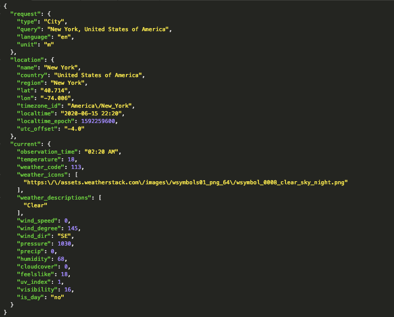

**Current Weather API  **
----
```
- Api will return the real-time weather data for a query with coordinates passed as lat/lng.
```
* **URL** <br/>
    * /api/currentWeatherDetails/`:coordinates`
* **Resource Information**

    * Response Format: `JSON`
    * Requires authentication? `Yes`
    * Rate Limited? `1000requests/month`
`
* **URL Params** <br/>
    * /api/currentWeatherDetails/`:coordinates`
    <br/>
        * **Required**: The `coordinates` can be passed location identifiers in order to get back the weather data.
    
        `1. coordinates (Lat/Lon)`</br>
            locationQuery = [number, number]

 
* **METHOD** 
```
Request type: 
- GET
```
* **DATA Params** 
```
None
```

* **Success Response:**
  * **Code:** 200 Success <br />
    **Content:** 
    </img>
    
`

* **Error Response:**
  * **Code:** 601 CUSTOM ERROR (MISSING QUERY)<br />
      **Content:** 
      {
  "success": false,
  "error": {
    "code": 601,
    "type": "missing_query",
    "info": "Please specify a valid location identifier using the query parameter."
  }
}
     
  * **Code:** 615 (REQUEST_FAILED) - Invalid PARAMS<br />
      **Content:** 
      {
  "success": false,
  "error": {
    "code": 615,
    "type": "request_failed",
    "info": "Your API request failed. Please try again or contact support."
  }
}   
  * **Code:** 101 (MISSING ACCESS KEY) - Invalid API KEY<br />
      **Content:** 
{
  "success": false,
  "error": {
    "code": 101,
    "type": "missing_access_key",
    "info": "You have not supplied an API Access Key. [Required format: access_key=YOUR_ACCESS_KEY]"
  }
}


* **Sample Call** 

  ```javascript
  let locationQuery = {lat: 40.7831,lng: -73.9712}

    fetch(`/api/currentWeatherDetails/${locationQuery}`)
  ```

